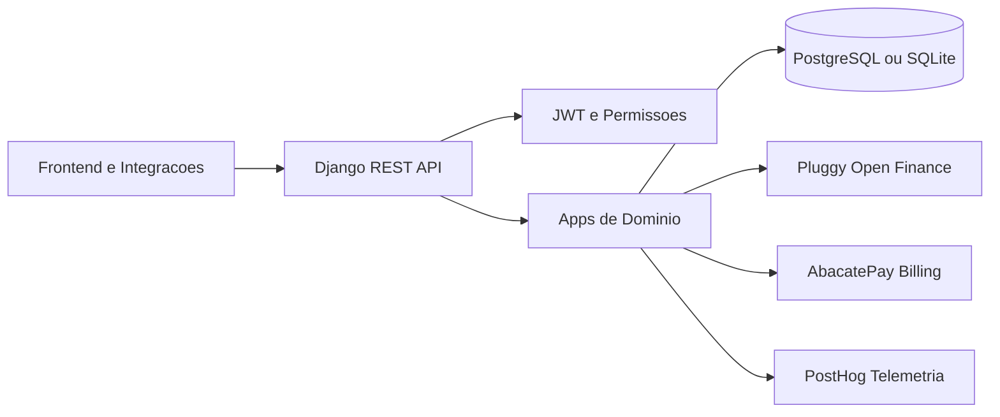

# ARCHITECTURE

## Objetivo

Este documento descreve a arquitetura tecnica do FinceCore para facilitar:

- onboarding de devs
- evolucao de modulos sem quebrar contratos
- operacao segura em ambiente real
- contribuicoes open source com contexto claro

FinceCore e o backend oficial da Fince e segue um modelo de desenvolvimento open source sob AGPLv3.

## Visao Geral do Sistema

FinceCore e uma API monolitica modular, baseada em Django + Django REST Framework, com separacao por contexto de dominio em apps sob `src/`.

## Principios Arquiteturais

- Monolito modular: um deploy, varios dominios isolados por app.
- API-first: contratos HTTP estaveis e documentados via OpenAPI.
- Tenant-aware: dados filtrados por escritorio (`Firm`) e associacao de membros.
- Evolucao incremental: regras de negocio proximas dos dominios, com servicos quando necessario.
- Observabilidade funcional: eventos de produto e operacao via telemetria.

## Stack e Runtime

- Linguagem: Python 3.12+
- Framework: Django 6 + DRF
- Auth: JWT (SimpleJWT) + blacklist de refresh token
- Schema/API docs: drf-spectacular
- Banco: PostgreSQL (padrao de deploy) com fallback SQLite local
- Servidor HTTP: Gunicorn (producao no container)

Referencias:

- `core/settings.py`
- `core/urls.py`
- `Dockerfile`
- `docker-compose.yml`

## Mapa de Modulos

Cada modulo segue, em geral, esta estrutura: `models/`, `serializers/`, `views/`, `urls.py`, `migrations/`.

Dominios principais:

- `src/users`: autenticacao, perfil, seguranca de conta, notificacoes, assinatura.
- `src/firms`: escritorio juridico e membros (base de tenancy).
- `src/dinheiro`: contas bancarias, transacoes, dashboard e Open Finance.
- `src/expenses`: despesas e classificacoes.
- `src/cases`: casos e estrutura de recebimento.
- `src/honorarios`: receitas de honorarios.
- `src/prolabore`: dados e regras de pro-labore.
- `src/outras_entradas`: outras entradas financeiras.
- `src/relatorios`: consolidacoes e analytics financeiro.
- `src/motor`: motor de apoio e automacoes.
- `src/suggestions`: feedback e sugestoes de produto.

## Fronteiras de API

As rotas sao centralizadas em `core/urls.py` e distribuidas por base path:

- `/api/auth/`
- `/api/firms/`
- `/api/finance/`
- `/api/expenses/`
- `/api/cases/`
- `/api/fees/`
- `/api/payroll/`
- `/api/other-income/`
- `/api/reports/`
- `/api/motor/`
- `/api/suggestions/`

Documentacao:

- `/api/schema/`
- `/api/docs/`
- `/api/redoc/`

## Fluxo de Requisicao

Fluxo tipico de uma request autenticada:

1. Cliente envia `Authorization: Bearer <token>`.
2. DRF autentica via JWT.
3. ViewSet/APIView valida permissao e contexto do usuario.
4. Queryset aplica filtro por usuario e, quando aplicavel, por `Firm`.
5. Serializer valida payload e persiste dados.
6. Regras de negocio complementares executam no proprio dominio.
7. Eventos de telemetria podem ser emitidos.
8. Resposta retorna JSON com status HTTP apropriado.

## Modelo de Tenancy e Autorizacao

O isolamento por escritorio e um pilar do sistema.

Entidades centrais:

- `users.User`: usuario autenticado por email.
- `firms.Firm`: escritorio juridico.
- `firms.FirmMember`: associacao N:N entre usuario e escritorio, com papel.

Padroes adotados nos modulos:

- filtros por associacao direta: `firm__members__user=request.user`
- descoberta do tenant ativo por membership primario: `request.user.firm_memberships.first()`
- bloqueio de operacoes sem vinculo de escritorio

Observacao importante:

- Hoje existe mais de um estilo de obtencao de `Firm` (filtro explicito vs helper local por membership). Funciona, mas pode ser padronizado no futuro por um mixin comum.

## Camadas de Dominio

No estado atual, a arquitetura segue uma abordagem pragmatica:

- `views`: orquestracao HTTP e fluxo de caso de uso
- `serializers`: validacao e transformacao de dados
- `models`: regras de persistencia e estrutura de dados
- `services`: integracoes externas e engines analiticas especificas

Exemplos:

- `src/dinheiro/services/pluggy.py`: cliente de Open Finance.
- `src/dinheiro/services/abacatepay.py`: checkout de assinatura.
- `src/relatorios/services/cashflow.py`: engine de consolidacao e metricas.

## Integracoes Externas

### Pluggy (Open Finance)

Responsavel por:

- gerar connect token
- sincronizar contas por item
- buscar transacoes por conta e periodo

No fluxo de sincronizacao, o sistema:

- atualiza item
- aguarda status de processamento
- faz upsert de contas locais
- dispara sincronizacao de extrato em background por thread

### AbacatePay (Billing)

Responsavel por:

- criar checkout de assinatura
- devolver URL/objeto de fluxo para continuidade no frontend

## Processamento Assincrono Atual

Nao ha, no momento, uma fila dedicada (como Celery/RQ).

O projeto usa thread em background para parte da importacao de extrato no modulo `dinheiro`. Isso reduz latencia para o usuario na request principal, mas nao oferece garantias avancadas de reprocessamento.

Direcao recomendada de evolucao:

- migrar jobs criticos para worker dedicado com fila
- adicionar retry estruturado e dead-letter strategy

## Dados e Consistencia

Padroes observados:

- uso de `transaction.atomic()` em operacoes sensiveis
- uso de `update_or_create` e `get_or_create` em sincronizacoes
- constraints relevantes em modelos (ex.: `unique_together`)

Esses mecanismos ajudam a manter consistencia em cenarios de concorrencia moderada.

## Seguranca

Medidas ativas no backend:

- autenticacao JWT com rotacao e blacklist de refresh token
- validadores de senha configurados
- cookies seguros e redirecionamento SSL quando `DEBUG=False`
- modelo de autorizacao orientado a usuario autenticado + tenancy

Pontos de atencao para producao:

- `ALLOWED_HOSTS = ["*"]` deve ser restringido por ambiente
- `CORS_ALLOW_ALL_ORIGINS = True` deve ser endurecido por dominio

## Observabilidade

A telemetria funcional utiliza `track_event` para registrar eventos de negocio e operacao (ex.: sincronizacao financeira, criacao de escritorio, erros de integracao), com envio para PostHog quando configurado.

Variaveis relevantes:

- `POSTHOG_API_KEY`
- `POSTHOG_HOST`

## Deploy e Ambientes

### Local

- `poetry install`
- `python manage.py migrate`
- `python manage.py runserver`

### Container

- `docker-compose` para ambiente local com Postgres
- `Dockerfile` com Gunicorn para execucao HTTP

## Convencoes para Evolucao

Ao criar novos endpoints/modulos, seguir estas diretrizes:

- manter separacao por dominio em `src/<modulo>`
- aplicar filtro por tenancy no queryset desde o inicio
- registrar eventos relevantes de negocio/erro
- documentar contrato no schema OpenAPI
- incluir migracoes e atualizar docs quando necessario

## Arquitetura Open Source

Como projeto open source de startup, a arquitetura precisa equilibrar velocidade e previsibilidade.

Compromissos deste repositorio:

- contratos de API claros e versionaveis
- codigo de dominio legivel e orientado a regras reais de produto
- documentacao viva para facilitar contribuicao externa
- evolucao tecnica incremental sem perder estabilidade
