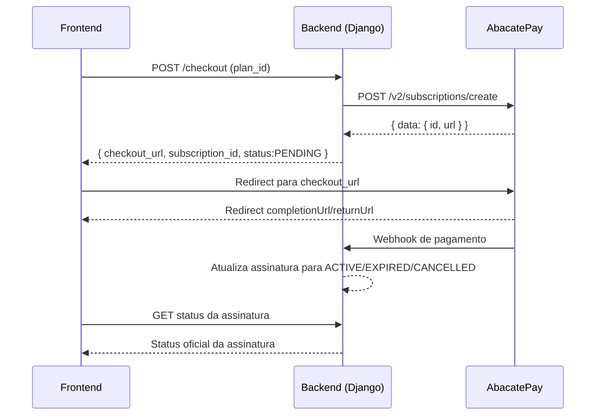

# Guia de Pagamento com AbacatePay

Este documento explica como a integracao com a AbacatePay funciona hoje no backend e como o frontend pode integrar de forma segura e previsivel.

## 1. Visao Geral

No projeto, o fluxo de pagamento por assinatura passa por 3 partes:

1. Backend cria um checkout de assinatura na AbacatePay.
2. Backend devolve a URL de checkout para o frontend.
3. Frontend redireciona o usuario para a pagina hospedada da AbacatePay.

Arquivos principais:

- `src/dinheiro/services/abacatepay.py`
- `src/users/views/subscription.py`
- `src/firms/models/subscription.py`

## 2. Como o Backend Conversa com a AbacatePay

Servico: `AbacatePayService` em `src/dinheiro/services/abacatepay.py`.

### 2.1 Configuracoes usadas

O servico usa estas variaveis de ambiente:

- `ABACATEPAY_API_KEY`
- `ABACATEPAY_COMPLETION_URL`
- `ABACATEPAY_RETURN_URL`

### 2.2 Endpoint externo chamado

- `POST https://api.abacatepay.com/v2/subscriptions/create`

Headers enviados:

```http
Authorization: Bearer <ABACATEPAY_API_KEY>
Content-Type: application/json
```

### 2.3 Payload enviado para a AbacatePay

```json
{
  "items": [
    {
      "id": "<plan.abacatepay_product_id>",
      "quantity": 1
    }
  ],
  "externalId": "<firm_subscription.id>",
  "completionUrl": "<ABACATEPAY_COMPLETION_URL>",
  "returnUrl": "<ABACATEPAY_RETURN_URL>",
  "methods": ["CARD"],
  "metadata": {
    "firm_id": "<uuid da firm>",
    "plan_name": "<nome do plano>",
    "user_email": "<email do usuario>"
  }
}
```

Observacoes:

- O item enviado usa o campo `Plan.abacatepay_product_id`.
- `externalId` amarra o checkout ao registro interno `FirmSubscription`.
- O metodo de pagamento esta fixado em `CARD`.

### 2.4 Tratamento de resposta no backend

Quando o gateway responde com sucesso (`status_code == 200`), o backend espera:

- `data.id` -> salvo em `FirmSubscription.abacatepay_billing_id`
- `data.url` -> devolvido ao frontend como `checkout_url`

Quando falha:

- resposta HTTP diferente de 200 -> `ValidationError` com texto retornado pelo gateway
- erro de rede/comunicacao -> `ValidationError` de comunicacao catasrofica

## 3. Fluxo Interno da Assinatura

View: `CriarAssinaturaView` em `src/users/views/subscription.py`.

Comportamento atual:

1. Recebe `plan_id` no body.
2. Valida se o plano existe e esta ativo (`Plan`).
3. Busca a firma do usuario autenticado (`firm_memberships.first()`).
4. Cria (ou reaproveita) `FirmSubscription` com status `PENDING`.
5. Chama a AbacatePay para criar checkout.
6. Salva `abacatepay_billing_id` na assinatura.
7. Retorna para o frontend:

```json
{
  "checkout_url": "https://...",
  "subscription_id": "<id interno>",
  "status": "PENDING"
}
```

## 4. Integracao de Frontend (Passo a Passo)

## 4.1 Contrato esperado da chamada

Request para o backend:

```http
POST <endpoint-interno-de-checkout>
Authorization: Bearer <token JWT>
Content-Type: application/json
```

```json
{
  "plan_id": 1
}
```

Response esperada (`200`):

```json
{
  "checkout_url": "https://checkout.abacatepay...",
  "subscription_id": 12,
  "status": "PENDING"
}
```

## 4.2 Redirecionamento

No frontend, apos receber `checkout_url`, redirecione imediatamente:

```ts
const response = await api.post('/api/auth/.../checkout', { plan_id });
const { checkout_url } = response.data;

if (!checkout_url) {
  throw new Error('Checkout nao retornou URL valida');
}

window.location.href = checkout_url;
```

## 4.3 Retorno para a aplicacao

O backend envia para AbacatePay dois links:

- `completionUrl`: pagina de sucesso
- `returnUrl`: pagina de retorno/voltar

Entao o frontend deve ter telas para:

- sucesso de pagamento (ex: `/dashboard?payment=success`)
- retorno para retry ou voltar ao billing

## 4.4 Pos-checkout no frontend

Ao voltar da AbacatePay:

1. Exibir estado "pagamento em processamento".
2. Consultar endpoint de assinatura atual.
3. Atualizar UI quando status virar `ACTIVE`.

Importante: nao confie apenas em query params da URL para liberar recurso premium.

## 5. Pontos Criticos do Estado Atual

Hoje existem gaps importantes no codigo:

1. A view `CriarAssinaturaView` existe, mas nao esta registrada em `src/users/urls.py`.
2. Nao existe endpoint de webhook da AbacatePay no repositorio para confirmar pagamento assincronamente.
3. Em `src/users/views/billing.py`, os endpoints de upgrade e cancelamento ainda retornam `501` (pendente de gateway).

Em resumo: o nucleo de criacao de checkout existe, mas o ciclo completo de assinatura (confirmacao assincrona, upgrade e cancelamento) ainda nao esta fechado.

## 6. Como Fechar a Integracao de Forma Robusta

Checklist recomendado:

1. Expor rota para `CriarAssinaturaView` em `src/users/urls.py`.
2. Criar endpoint de webhook com validacao de assinatura da AbacatePay.
3. Atualizar `FirmSubscription.status` com base no evento de pagamento.
4. Registrar data de fim de ciclo (`current_period_end`) a partir do evento confirmado.
5. Fazer idempotencia por `abacatepay_billing_id`/`event_id` para nao processar evento duplicado.
6. Atualizar frontend para refletir status vindo do backend, nunca direto do provedor.

## 7. Fluxo Ideal (Arquitetura)



## 8. Regras de Ouro para o Frontend

1. Sempre chamar o backend para criar checkout (nunca expor API key no cliente).
2. Sempre usar status vindo do backend para liberar recursos premium.
3. Tratar timeout e erro de rede com opcao de tentar novamente.
4. Ter telas de sucesso, falha e processamento.
5. Salvar contexto local (`subscription_id`, `plan_id`) para retomar fluxo apos redirecionamento.

## 9. Resumo Executivo

O projeto ja possui integracao funcional para gerar checkout de assinatura na AbacatePay e redirecionar o usuario. O que falta para producao robusta e fechar a etapa assincrona (webhook + reconciliacao de status) e expor formalmente a rota da view de criacao de assinatura.