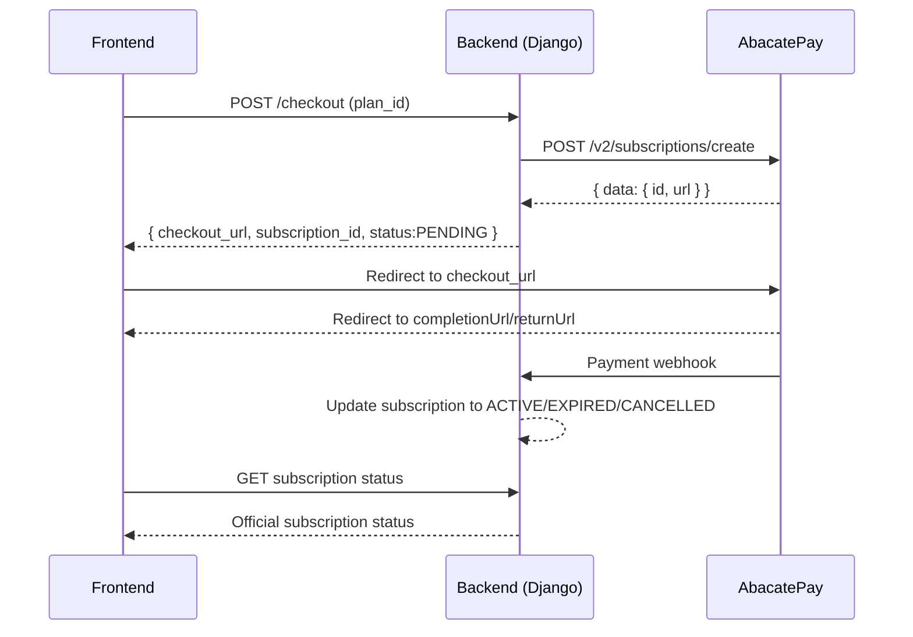

# AbacatePay Payment Integration Guide

This document explains how the current AbacatePay subscription checkout flow works in the backend and how the frontend should integrate with it safely.

## 1. Overview

The subscription payment flow has three steps:

1. Backend creates a subscription checkout on AbacatePay.
2. Backend returns the checkout URL to the frontend.
3. Frontend redirects the user to AbacatePay hosted checkout.

Main files:

- `src/finance/services/abacatepay.py`
- `src/users/views/subscription.py`
- `src/firms/models/subscription.py`

## 2. Backend Integration with AbacatePay

Service: `AbacatePayService` in `src/finance/services/abacatepay.py`.

### 2.1 Required configuration

Environment variables used by the service:

- `ABACATEPAY_API_KEY`
- `ABACATEPAY_COMPLETION_URL`
- `ABACATEPAY_RETURN_URL`

### 2.2 External endpoint called

- `POST https://api.abacatepay.com/v2/subscriptions/create`

Request headers:

```http
Authorization: Bearer <ABACATEPAY_API_KEY>
Content-Type: application/json
```

### 2.3 Payload sent to AbacatePay

```json
{
  "items": [
    {
      "id": "<plan.abacatepay_product_id>",
      "quantity": 1
    }
  ],
  "externalId": "<firm_subscription.id>",
  "completionUrl": "<ABACATEPAY_COMPLETION_URL>",
  "returnUrl": "<ABACATEPAY_RETURN_URL>",
  "methods": ["CARD"],
  "metadata": {
    "firm_id": "<firm uuid>",
    "plan_name": "<plan name>",
    "user_email": "<user email>"
  }
}
```

Notes:

- The item uses `Plan.abacatepay_product_id`.
- `externalId` links the checkout to internal `FirmSubscription`.
- Payment method is currently fixed as `CARD`.

### 2.4 Backend response handling

When gateway response is successful (`status_code == 200`), backend expects:

- `data.id` -> stored in `FirmSubscription.abacatepay_billing_id`
- `data.url` -> returned to frontend as `checkout_url`

Failure paths:

- non-200 response -> `ValidationError` with gateway message
- network/communication failure -> communication `ValidationError`

## 3. Internal Subscription Flow

View: `CriarAssinaturaView` in `src/users/views/subscription.py`.

Current behavior:

1. Receives `plan_id` in request body.
2. Validates plan exists and is active (`Plan`).
3. Gets authenticated user's firm (`firm_memberships.first()`).
4. Creates or reuses `FirmSubscription` with status `PENDING`.
5. Calls AbacatePay to create checkout.
6. Saves `abacatepay_billing_id` in subscription.
7. Returns:

```json
{
  "checkout_url": "https://...",
  "subscription_id": "<internal id>",
  "status": "PENDING"
}
```

## 4. Frontend Integration

### 4.1 API contract

```http
POST /api/auth/subscription/checkout/
Authorization: Bearer <JWT token>
Content-Type: application/json
```

```json
{
  "plan_id": 1
}
```

Expected `200` response:

```json
{
  "checkout_url": "https://checkout.abacatepay...",
  "subscription_id": 12,
  "status": "PENDING"
}
```

### 4.2 Redirect

```ts
const response = await api.post('/api/auth/subscription/checkout/', { plan_id });
const { checkout_url } = response.data;

if (!checkout_url) {
  throw new Error('Checkout did not return a valid URL');
}

window.location.href = checkout_url;
```

### 4.3 Return URLs

Backend sends two URLs to AbacatePay:

- `completionUrl`: success page
- `returnUrl`: return/back page

Frontend should provide both UX states.

### 4.4 Post-checkout flow

After user returns from AbacatePay:

1. Show "payment processing" state.
2. Poll or fetch current subscription endpoint.
3. Update UI when status becomes `ACTIVE`.

Do not grant premium access only from URL query params.

## 5. Current Gaps

Important known gaps in current codebase:

1. Checkout view is now registered in `src/users/urls.py`, including two routes.
2. There is no AbacatePay webhook endpoint yet for async confirmation.
3. In `src/users/views/billing.py`, upgrade and cancel endpoints still return `501`.

## 6. Recommended Hardening Checklist

1. Add webhook endpoint with signature validation.
2. Update `FirmSubscription.status` from payment events.
3. Persist cycle end (`current_period_end`) from confirmed events.
4. Add idempotency by `abacatepay_billing_id` and/or provider event ID.
5. Keep frontend status driven by backend state, never directly by provider callback params.

## 7. Ideal Architecture



## 8. Frontend Golden Rules

1. Always create checkout through backend.
2. Never expose provider API keys in client apps.
3. Use backend subscription status as source of truth.
4. Handle network errors and retries.
5. Keep local context (`subscription_id`, `plan_id`) to resume UX after redirect.

## 9. Executive Summary

The project already supports generating AbacatePay checkout links and redirecting users. Production readiness depends on async webhook reconciliation and completion of upgrade/cancel gateway flows.
