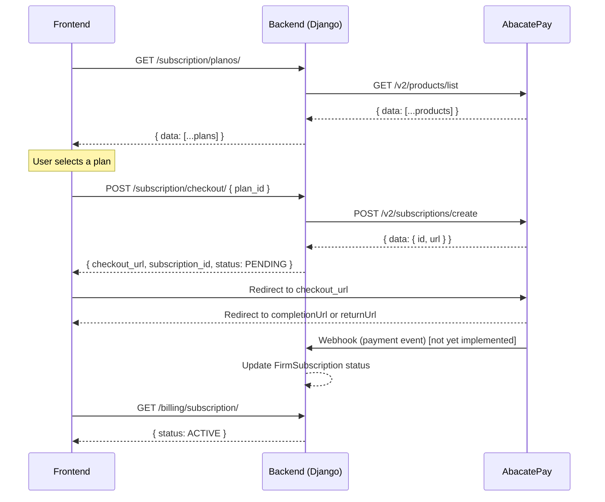

# AbacatePay Payment Integration Guide

This document describes the complete subscription payment flow between the frontend, the Fincecore backend, and the AbacatePay gateway.

## 1. Overview

The full integration has three steps:

1. **List plans** — frontend fetches available products from the backend, which proxies AbacatePay's product catalog.
2. **User selects a plan** — frontend presents the options; user picks one.
3. **Create checkout** — frontend sends the chosen product ID to the backend, which creates a subscription checkout on AbacatePay and returns a hosted checkout URL.

Main files:

- `src/finance/services/abacatepay.py` — `AbacatePayService`
- `src/users/views/subscription.py` — `ListarPlanosView`, `CriarAssinaturaView`
- `src/firms/models/subscription.py` — `Plan`, `FirmSubscription`

---

## 2. Step 1 — Fetch Available Plans

### 2.1 Backend endpoint

```http
GET /api/auth/subscription/planos/
Authorization: Bearer <JWT token>
```

The backend calls `GET https://api.abacatepay.com/v2/products/list` internally, filters for `ACTIVE` products, and returns a normalized list.

**Response `200`:**

```json
{
  "data": [
    {
      "id": "prod_abc123xyz",
      "name": "Professional Plan",
      "description": "Full access for law firms",
      "price": 19900,
      "currency": "BRL",
      "cycle": "MONTHLY",
      "imageUrl": null,
      "status": "ACTIVE"
    }
  ]
}
```

> **Note on `price`:** value is in cents. Divide by 100 to display (e.g. `19900` → R$199,00).

### 2.2 AbacatePay external call

```http
GET https://api.abacatepay.com/v2/products/list?limit=100
Authorization: Bearer <ABACATEPAY_API_KEY>
```

Handled by `AbacatePayService.listar_produtos()` in `src/finance/services/abacatepay.py`.

### 2.3 Frontend usage

```ts
const { data } = await api.get('/api/auth/subscription/planos/');
// data.data is the list of plans — render them in your pricing UI
```

---

## 3. Step 2 — User Selects a Plan

The frontend renders the plan list and stores the chosen plan's `id` (e.g. `"prod_abc123xyz"`) locally. No backend call is needed at this step.

---

## 4. Step 3 — Create Subscription Checkout

### 4.1 Backend endpoint

```http
POST /api/auth/subscription/checkout/
Authorization: Bearer <JWT token>
Content-Type: application/json
```

**Request body:**

```json
{
  "plan_id": "prod_abc123xyz"
}
```

`plan_id` accepts either the AbacatePay product ID (`prod_*`) or the internal numeric `Plan.id`.

**Response `200`:**

```json
{
  "checkout_url": "https://checkout.abacatepay.com/...",
  "subscription_id": 42,
  "status": "PENDING"
}
```

### 4.2 What the backend does internally

View: `CriarAssinaturaView` in `src/users/views/subscription.py`.

1. Resolves `plan_id` to an active `Plan` record (creates a stub if it only exists in the gateway).
2. Gets the authenticated user's firm via `firm_memberships.first()`.
3. Creates or reuses a `FirmSubscription` with status `PENDING`.
4. Calls `AbacatePayService.criar_checkout_assinatura()` → `POST https://api.abacatepay.com/v2/subscriptions/create`.
5. Stores the returned billing ID in `FirmSubscription.abacatepay_billing_id`.
6. Returns `checkout_url`, `subscription_id`, and `status`.

### 4.3 AbacatePay external call

```http
POST https://api.abacatepay.com/v2/subscriptions/create
Authorization: Bearer <ABACATEPAY_API_KEY>
Content-Type: application/json
```

```json
{
  "items": [{ "id": "<plan.abacatepay_product_id>", "quantity": 1 }],
  "externalId": "<firm_subscription.id>",
  "completionUrl": "<FRONTEND_URL>/app/payment/success",
  "returnUrl": "<FRONTEND_URL>/app/payment/return",
  "methods": ["CARD"],
  "metadata": {
    "firm_id": "<firm uuid>",
    "plan_name": "<plan name>",
    "user_email": "<user email>"
  }
}
```

### 4.4 Frontend redirect

```ts
const { data } = await api.post('/api/auth/subscription/checkout/', { plan_id: selectedPlanId });
const { checkout_url } = data;

if (!checkout_url) {
  throw new Error('No checkout URL returned');
}

window.location.href = checkout_url;
```

Store `subscription_id` locally so you can resume the UX after the redirect.

### 4.5 Return URLs

After payment, AbacatePay redirects to one of:

- `completionUrl` (`/app/payment/success`) — payment was completed.
- `returnUrl` (`/app/payment/return`) — user navigated back without completing.

Both are derived from `FRONTEND_URL` env var on the backend.

---

## 5. Post-Checkout Flow

After the user lands back on the frontend:

1. Show a "processing payment" state — do **not** grant access based on URL params alone.
2. Poll `GET /api/auth/billing/subscription/` or re-fetch subscription status from the backend.
3. Update the UI when status transitions to `ACTIVE`.

---

## 6. Full Sequence Diagram



---

## 7. Environment Variables

| Variable | Purpose |
|---|---|
| `ABACATEPAY_API_KEY` | API key for all gateway calls |
| `FRONTEND_URL` | Base URL used to build `completionUrl` and `returnUrl` |
| `ABACATEPAY_COMPLETION_URL` | Fallback if `FRONTEND_URL` is not set |
| `ABACATEPAY_RETURN_URL` | Fallback if `FRONTEND_URL` is not set |

---

## 8. Known Gaps

1. No webhook endpoint yet — `FirmSubscription.status` is not updated automatically after payment.
2. Upgrade and cancel flows in `src/users/views/billing.py` still return `501`.

## 9. Hardening Checklist

1. Add webhook endpoint with signature validation.
2. Update `FirmSubscription.status` from webhook payment events.
3. Persist `current_period_end` from confirmed subscription events.
4. Add idempotency guard by `abacatepay_billing_id` / provider event ID.
5. Never trust frontend-supplied payment status — always verify via backend state.
