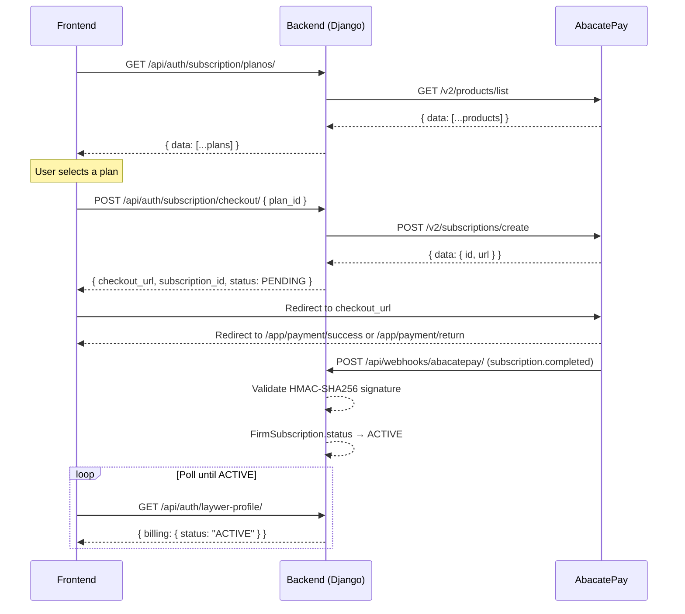

# AbacatePay Payment Integration Guide

This document describes the complete subscription payment flow between the frontend, the Fincecore backend, and the AbacatePay gateway.

## 1. Overview

The full integration has four steps:

1. **List plans** — frontend fetches available products from the backend, which proxies AbacatePay's product catalog.
2. **User selects a plan** — frontend presents the options; user picks one.
3. **Create checkout** — frontend sends the chosen product ID to the backend, which creates a subscription checkout on AbacatePay and returns a hosted checkout URL.
4. **Webhook confirmation** — AbacatePay calls the backend after payment events; the backend updates subscription status.

Main files:

| File | Responsibility |
|---|---|
| `src/finance/services/abacatepay.py` | `AbacatePayService` — all outbound API calls |
| `src/users/views/subscription.py` | `ListarPlanosView`, `CriarAssinaturaView` |
| `src/firms/views/webhook.py` | `AbacatePayWebhookView` — inbound webhook handler |
| `src/firms/models/subscription.py` | `Plan`, `FirmSubscription` — source of truth for billing state |
| `src/users/serializers/laywer.py` | Exposes `billing` field from `FirmSubscription` on the lawyer profile |

---

## 2. Step 1 — Fetch Available Plans

### Endpoint

```http
GET /api/auth/subscription/planos/
Authorization: Bearer <JWT token>
```

The backend calls `GET https://api.abacatepay.com/v2/products/list` internally, filters for `ACTIVE` products, and returns a normalized list.

**Response `200`:**

```json
{
  "data": [
    {
      "id": "prod_abc123xyz",
      "name": "Professional Plan",
      "description": "Full access for law firms",
      "price": 19900,
      "currency": "BRL",
      "cycle": "MONTHLY",
      "imageUrl": null,
      "status": "ACTIVE"
    }
  ]
}
```

> `price` is in cents. Divide by 100 to display (e.g. `19900` → R$199,00).

> `cycle` values: `MONTHLY`, `ANNUAL`, `SEMIANNUAL`. AbacatePay's API returns `ANNUALLY` / `SEMIANNUALLY`; the backend normalizes these to `ANNUAL` / `SEMIANNUAL` before returning.

### AbacatePay external call

```http
GET https://api.abacatepay.com/v2/products/list?limit=100
Authorization: Bearer <ABACATEPAY_API_KEY>
```

Handled by `AbacatePayService.listar_produtos()`.

---

## 3. Step 2 — User Selects a Plan

The frontend renders the plan list and stores the chosen plan's `id` (e.g. `"prod_abc123xyz"`) locally. No backend call is needed at this step.

---

## 4. Step 3 — Create Subscription Checkout

### Endpoint

```http
POST /api/auth/subscription/checkout/
Authorization: Bearer <JWT token>
Content-Type: application/json
```

Also available at `/api/auth/billing/subscription/checkout/` (legacy alias — both routes point to the same view).

**Request body:**

```json
{
  "plan_id": "prod_abc123xyz"
}
```

`plan_id` accepts either the AbacatePay product ID (`prod_*`) or the internal numeric `Plan.id`.

**Response `200`:**

```json
{
  "checkout_url": "https://checkout.abacatepay.com/...",
  "subscription_id": 42,
  "status": "PENDING"
}
```

### What the backend does internally

View: `CriarAssinaturaView` in `src/users/views/subscription.py`.

1. Resolves `plan_id` to an active `Plan` record (creates a stub if only the gateway product ID is known).
2. Gets the authenticated user's firm via `firm_memberships.first()`.
3. Creates or reuses a `FirmSubscription` with `status = PENDING`.
4. Calls `AbacatePayService.criar_checkout_assinatura()` → `POST https://api.abacatepay.com/v2/subscriptions/create`.
5. Persists the returned billing ID in `FirmSubscription.abacatepay_billing_id`.
6. Returns `checkout_url`, `subscription_id`, and `status`.

### AbacatePay external call

```http
POST https://api.abacatepay.com/v2/subscriptions/create
Authorization: Bearer <ABACATEPAY_API_KEY>
Content-Type: application/json
```

```json
{
  "items": [{ "id": "<plan.abacatepay_product_id>", "quantity": 1 }],
  "externalId": "<firm_subscription.id>",
  "completionUrl": "https://www.suafince.com.br/app/payment/success",
  "returnUrl": "https://www.suafince.com.br/app/payment/return",
  "methods": ["CARD"],
  "metadata": {
    "firm_id": "<firm uuid>",
    "plan_name": "<plan name>",
    "user_email": "<user email>"
  }
}
```

`completionUrl` and `returnUrl` are built from the `FRONTEND_URL` environment variable. If `FRONTEND_URL` is not set, they fall back to `ABACATEPAY_COMPLETION_URL` and `ABACATEPAY_RETURN_URL`.

### Frontend redirect

```ts
const { data } = await api.post('/api/auth/subscription/checkout/', { plan_id: selectedPlanId });
window.location.href = data.checkout_url;
```

Store `subscription_id` locally before redirecting so you can resume the UX after return.

### Return URLs

After the payment interaction, AbacatePay redirects to:

- `/app/payment/success` — payment was completed.
- `/app/payment/return` — user navigated back without completing.

---

## 5. Step 4 — Webhook Confirmation

AbacatePay calls the webhook endpoint after payment events. The backend updates `FirmSubscription.status` accordingly.

### Endpoint

```http
POST /api/webhooks/abacatepay/
```

No authentication required. Requests are validated by HMAC-SHA256 signature (see below).

### Handled events

| Event | Action |
|---|---|
| `subscription.completed` | `FirmSubscription.status → ACTIVE`, persists `current_period_end` |
| `subscription.renewed` | `FirmSubscription.status → ACTIVE`, updates `current_period_end` |
| `subscription.cancelled` | `FirmSubscription.status → CANCELLED` |

Unrecognised events receive `200 OK` with no state change.

### Signature validation

AbacatePay signs each webhook with `HMAC-SHA256` using the configured secret. The backend validates the `X-Webhook-Signature` header before processing:

```python
expected = base64.b64encode(
    hmac.new(secret.encode(), request.body, hashlib.sha256).digest()
).decode()
hmac.compare_digest(expected, received_signature)
```

If `ABACATEPAY_WEBHOOK_SECRET` is not set in the environment, validation is skipped with a warning log (development only — always configure the secret in production).

### Subscription lookup

The handler looks up `FirmSubscription` in order:

1. By `abacatepay_billing_id` (from `data.id` in the payload).
2. By internal PK (from `data.externalId`, which equals `FirmSubscription.id` set at checkout time).

If no subscription is found, returns `200 OK` to prevent AbacatePay from retrying indefinitely.

### Dashboard configuration

Register the webhook in the AbacatePay dashboard pointing to:

```
https://api.suafince.com.br/api/webhooks/abacatepay/
```

Select events: `subscription.completed`, `subscription.renewed`, `subscription.cancelled`. Copy the generated secret into `ABACATEPAY_WEBHOOK_SECRET` on Railway and in `.env` locally.

---

## 6. Post-Payment Status Polling

After the user lands on `/app/payment/success`, the frontend polls the lawyer profile to detect activation:

```http
GET /api/auth/laywer-profile/
Authorization: Bearer <JWT token>
```

The `billing` field in the response comes from `FirmSubscription` (the same record updated by the webhook):

```json
{
  "billing": {
    "status": "ACTIVE",
    "is_premium_active": true,
    "next_renewal": "10/07/2026",
    "plan_details": {
      "id": 1,
      "name": "Professional Plan",
      "price": "199.00",
      "cycle": "MONTHLY"
    }
  }
}
```

Poll until `billing.status === 'ACTIVE'`. Do not grant access based on URL params alone.

---

## 7. Full Sequence Diagram



---

## 8. Environment Variables

| Variable | Purpose |
|---|---|
| `ABACATEPAY_API_KEY` | API key for all outbound gateway calls |
| `ABACATEPAY_WEBHOOK_SECRET` | HMAC-SHA256 secret for validating inbound webhooks |
| `FRONTEND_URL` | Base URL used to build `completionUrl` and `returnUrl` |
| `ABACATEPAY_COMPLETION_URL` | Fallback `completionUrl` if `FRONTEND_URL` is not set |
| `ABACATEPAY_RETURN_URL` | Fallback `returnUrl` if `FRONTEND_URL` is not set |

---

## 9. Known Gaps

- Upgrade and cancel flows in `src/users/views/billing.py` still return `501 Not Implemented`.
