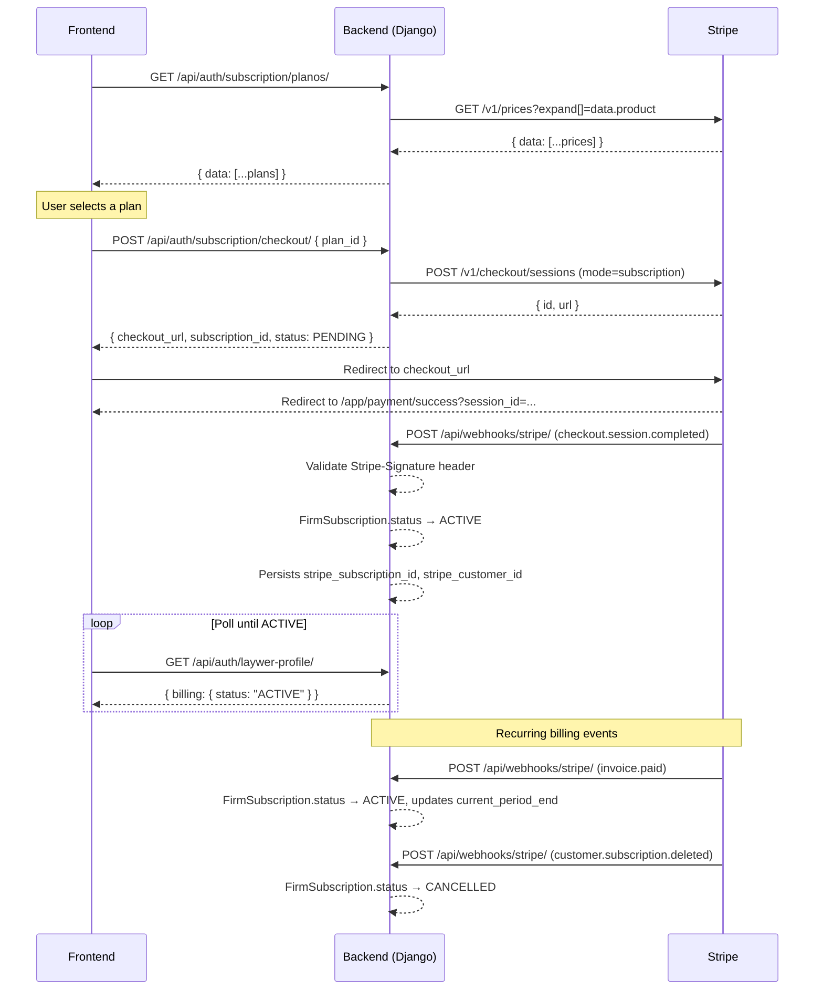

# Stripe Payment Integration Guide

This document describes the complete subscription payment flow between the frontend, the Fincecore backend, and the Stripe gateway.

## 1. Overview

The full integration has four steps:

1. **List plans** — frontend fetches available products from the backend, which proxies Stripe's price catalog.
2. **User selects a plan** — frontend presents the options; user picks one.
3. **Create checkout** — frontend sends the chosen price ID to the backend, which creates a Stripe Checkout Session and returns a hosted checkout URL.
4. **Webhook confirmation** — Stripe calls the backend after payment events; the backend updates subscription status.

Main files:

| File | Responsibility |
|---|---|
| `src/finance/services/stripe_service.py` | `StripeService` — all outbound API calls |
| `src/users/views/subscription.py` | `ListarPlanosView`, `CriarAssinaturaView` |
| `src/firms/views/stripe_webhook.py` | `StripeWebhookView` — inbound webhook handler |
| `src/firms/models/subscription.py` | `Plan` (`stripe_price_id`), `FirmSubscription` (`stripe_subscription_id`, `stripe_customer_id`) |
| `src/users/serializers/laywer.py` | Exposes `billing` field from `FirmSubscription` on the lawyer profile |

---

## 2. Step 1 — Fetch Available Plans

### Endpoint

```http
GET /api/auth/subscription/planos/
Authorization: Bearer <JWT token>
```

The backend calls `stripe.Price.list()` internally, filters for active prices with a recurring interval, and returns a normalized list.

**Response `200`:**

```json
{
  "data": [
    {
      "id": "price_1Abc123XYZ",
      "name": "Professional Plan",
      "description": "Full access for law firms",
      "price": 19900,
      "currency": "BRL",
      "cycle": "MONTHLY",
      "imageUrl": null,
      "status": "ACTIVE"
    }
  ]
}
```

> `price` is in cents. Divide by 100 to display (e.g. `19900` → R$199,00).

> `id` is the Stripe Price ID (`price_*`). This is what you send in the checkout step.

> `cycle` values: `MONTHLY`, `ANNUAL`, `SEMIANNUAL`. Stripe's API returns `month` / `year`; the backend normalizes these before returning.

### Stripe external call

```http
GET https://api.stripe.com/v1/prices
Authorization: Bearer <STRIPE_SECRET_KEY>
```

Handled by `StripeService.listar_planos()`. Expands `data.product` to retrieve product name and description in a single call.

---

## 3. Step 2 — User Selects a Plan

The frontend renders the plan list and stores the chosen plan's `id` (e.g. `"price_1Abc123XYZ"`) locally. No backend call is needed at this step.

---

## 4. Step 3 — Create Subscription Checkout

### Endpoint

```http
POST /api/auth/subscription/checkout/
Authorization: Bearer <JWT token>
Content-Type: application/json
```

Also available at `/api/auth/billing/subscription/checkout/` (legacy alias — both routes point to the same view).

**Request body:**

```json
{
  "plan_id": "price_1Abc123XYZ"
}
```

`plan_id` accepts either the Stripe Price ID (`price_*`) or the internal numeric `Plan.id`.

**Response `200`:**

```json
{
  "checkout_url": "https://checkout.stripe.com/pay/cs_live_...",
  "subscription_id": 42,
  "status": "PENDING"
}
```

### What the backend does internally

View: `CriarAssinaturaView` in `src/users/views/subscription.py`.

1. Resolves `plan_id` to an active `Plan` record (creates a stub if only the Stripe price ID is known).
2. Gets the authenticated user's firm via `firm_memberships.first()`.
3. Creates or reuses a `FirmSubscription` with `status = PENDING`.
4. Calls `StripeService.criar_checkout_session()` → Stripe Checkout Session API.
5. Returns `checkout_url`, `subscription_id`, and `status`.

> `stripe_subscription_id` and `stripe_customer_id` are populated later by the webhook, not at checkout creation time.

### Stripe external call

```http
POST https://api.stripe.com/v1/checkout/sessions
Authorization: Bearer <STRIPE_SECRET_KEY>
```

```json
{
  "mode": "subscription",
  "line_items": [{ "price": "<plan.stripe_price_id>", "quantity": 1 }],
  "success_url": "https://www.suafince.com.br/app/payment/success?session_id={CHECKOUT_SESSION_ID}",
  "cancel_url": "https://www.suafince.com.br/app/payment/return",
  "metadata": {
    "firm_subscription_id": "<firm_subscription.id>",
    "firm_id": "<firm uuid>",
    "plan_name": "<plan name>",
    "user_email": "<user email>"
  }
}
```

`success_url` and `cancel_url` are built from the `FRONTEND_URL` environment variable.

### Frontend redirect

```ts
const { data } = await api.post('/api/auth/subscription/checkout/', { plan_id: selectedPlanId });
window.location.href = data.checkout_url;
```

Store `subscription_id` locally before redirecting so you can resume the UX after return.

### Return URLs

After the payment interaction, Stripe redirects to:

- `/app/payment/success?session_id={CHECKOUT_SESSION_ID}` — payment was completed.
- `/app/payment/return` — user navigated back without completing.

---

## 5. Step 4 — Webhook Confirmation

Stripe calls the webhook endpoint after payment events. The backend updates `FirmSubscription.status` accordingly.

### Endpoint

```http
POST /api/webhooks/stripe/
```

No authentication required. Requests are validated by Stripe's signature verification (see below).

### Handled events

| Event | Action |
|---|---|
| `checkout.session.completed` | `FirmSubscription.status → ACTIVE`, persists `stripe_subscription_id`, `stripe_customer_id`, `current_period_end` |
| `invoice.paid` | `FirmSubscription.status → ACTIVE`, updates `current_period_end` |
| `customer.subscription.updated` | Updates `current_period_end`; if `status == canceled` sets `CANCELLED` |
| `customer.subscription.deleted` | `FirmSubscription.status → CANCELLED` |

Unrecognised events receive `200 OK` with no state change.

### Signature validation

Stripe signs each webhook using a timestamp + HMAC-SHA256 scheme. The backend validates the `Stripe-Signature` header using the official SDK:

```python
import stripe

event = stripe.Webhook.construct_event(
    payload=request.body,
    sig_header=request.headers.get("Stripe-Signature"),
    secret=settings.STRIPE_WEBHOOK_SECRET,
)
```

If validation fails, returns `400 Bad Request`. Never process a webhook that fails signature validation.

### Subscription lookup

The handler looks up `FirmSubscription` from `checkout.session.completed` using `metadata.firm_subscription_id` set at checkout creation time.

For renewal/cancellation events (`invoice.paid`, `customer.subscription.*`), lookup is done by `stripe_subscription_id`.

If no subscription is found, returns `200 OK` to prevent Stripe from retrying indefinitely.

### Dashboard configuration

Register the webhook in the Stripe dashboard pointing to:

```
https://api.suafince.com.br/api/webhooks/stripe/
```

Select events: `checkout.session.completed`, `invoice.paid`, `customer.subscription.updated`, `customer.subscription.deleted`. Copy the generated signing secret (`whsec_*`) into `STRIPE_WEBHOOK_SECRET` on Railway and in `.env` locally.

---

## 6. Post-Payment Status Polling

After the user lands on `/app/payment/success`, the frontend polls the lawyer profile to detect activation:

```http
GET /api/auth/laywer-profile/
Authorization: Bearer <JWT token>
```

The `billing` field in the response comes from `FirmSubscription` (the same record updated by the webhook):

```json
{
  "billing": {
    "status": "ACTIVE",
    "is_premium_active": true,
    "next_renewal": "10/07/2026",
    "plan_details": {
      "id": 1,
      "name": "Professional Plan",
      "price": "199.00",
      "cycle": "MONTHLY"
    }
  }
}
```

Poll until `billing.status === 'ACTIVE'`. Do not grant access based on URL params or `session_id` alone.

---

## 7. Full Sequence Diagram



---

## 8. Environment Variables

| Variable | Purpose |
|---|---|
| `STRIPE_SECRET_KEY` | Secret key for all server-side Stripe API calls (`sk_live_*` or `sk_test_*`) — never exposed to the client |
| `STRIPE_PUBLISHABLE_KEY` | Publishable key returned to the frontend for Stripe.js usage (`pk_live_*` or `pk_test_*`) — safe to expose |
| `STRIPE_WEBHOOK_SECRET` | Signing secret for validating inbound webhooks (`whsec_*`) |
| `FRONTEND_URL` | Base URL used to build `success_url` and `cancel_url` |

### Where each key is used

- **`STRIPE_SECRET_KEY`** — used exclusively in `StripeService.__init__()` to set `stripe.api_key`. Never returned in any response.
- **`STRIPE_PUBLISHABLE_KEY`** — returned in the `GET /api/auth/subscription/planos/` response as `stripe_publishable_key`. The frontend uses this to initialize `Stripe(publishable_key)` when building custom payment forms with Stripe Elements (optional for the hosted Checkout flow).

**Response shape with the publishable key:**

```json
{
  "data": [...plans],
  "stripe_publishable_key": "pk_live_..."
}
```

---

## 9. Model Fields Added

| Model | Field | Type | Purpose |
|---|---|---|---|
| `Plan` | `stripe_price_id` | `CharField` (nullable) | Stripe Price ID (`price_*`) |
| `FirmSubscription` | `stripe_subscription_id` | `CharField` (nullable) | Stripe Subscription ID (`sub_*`) — set by webhook |
| `FirmSubscription` | `stripe_customer_id` | `CharField` (nullable) | Stripe Customer ID (`cus_*`) — set by webhook |

AbacatePay fields (`abacatepay_product_id`, `abacatepay_billing_id`) remain in the models for future use.

---

## 10. Known Gaps

- Upgrade and cancel flows in `src/users/views/billing.py` still return `501 Not Implemented`.
- `stripe_customer_id` is stored per-subscription, not per-firm. If a firm cancels and resubscribes, a new Stripe customer is created.
