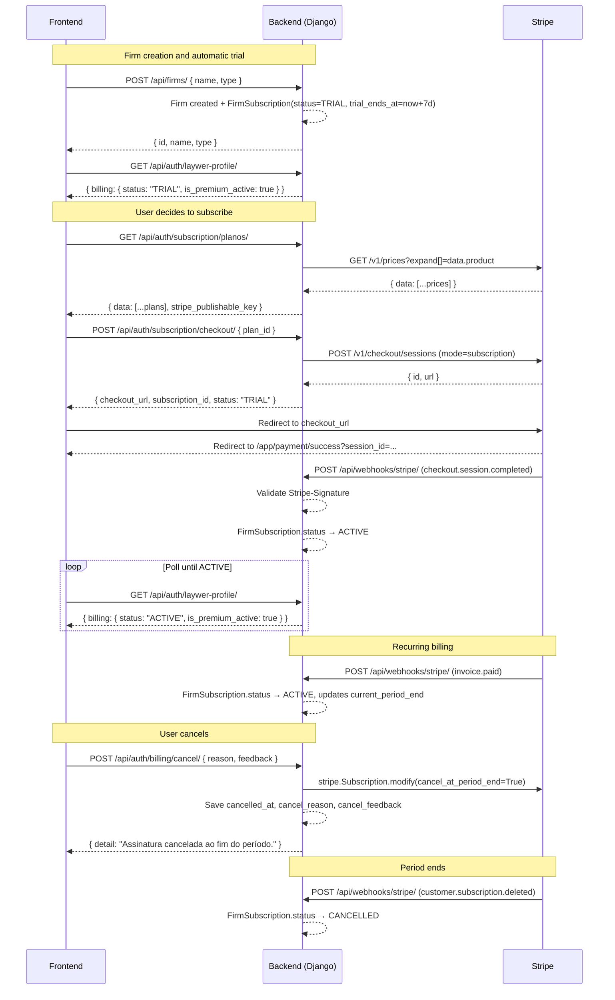

# Stripe Payment Integration Guide

This document describes the complete subscription payment flow between the frontend, the Fincecore backend, and the Stripe gateway — including the 7-day free trial, checkout, recurring billing, and cancellation.

## 1. Overview

| Step | Description |
|---|---|
| Trial | Firm is created → 7-day free trial starts automatically, no credit card required |
| List plans | Frontend fetches available plans from the backend |
| Checkout | Frontend sends chosen price ID → backend creates a Stripe Checkout Session |
| Webhook | Stripe notifies backend of payment events; backend updates subscription status |
| Cancel | User requests cancellation → access continues until period end |

Main files:

| File | Responsibility |
|---|---|
| `src/finance/services/stripe_service.py` | `StripeService` — all outbound Stripe API calls |
| `src/users/views/subscription.py` | `ListarPlanosView`, `CriarAssinaturaView`, `CancelarAssinaturaView` |
| `src/firms/views/stripe_webhook.py` | `StripeWebhookView` — inbound webhook handler |
| `src/firms/models/subscription.py` | `Plan`, `FirmSubscription` |
| `src/users/serializers/laywer.py` | Exposes `billing` field on the lawyer profile |

---

## 2. Free Trial (Automatic)

When a firm is created via `POST /api/firms/`, the backend automatically creates a `FirmSubscription` with:

```json
{
  "status": "TRIAL",
  "trial_ends_at": "<now + 7 days>"
}
```

No credit card required. Access is fully active during the trial period.

The `billing` object on the lawyer profile reflects trial state:

```json
{
  "status": "TRIAL",
  "is_premium_active": true,
  "is_on_trial": true,
  "trial_ends_at": "22/06/2026",
  "next_renewal": null,
  "plan_details": null
}
```

After trial expiry, `is_premium_active` becomes `false` until the user subscribes.

---

## 3. List Available Plans

```http
GET /api/auth/subscription/planos/
Authorization: Bearer <JWT>
```

The backend proxies Stripe's price catalog via `stripe.Price.list()`, filtering for active recurring prices.

**Response `200`:**

```json
{
  "data": [
    {
      "id": "price_1Abc123XYZ",
      "name": "Professional Plan",
      "description": "Full access for law firms",
      "price": 19900,
      "currency": "BRL",
      "cycle": "MONTHLY",
      "status": "ACTIVE"
    }
  ],
  "stripe_publishable_key": "pk_live_..."
}
```

> `price` is in cents. Divide by 100 to display (e.g. `19900` → R$199.00).

> `id` is the Stripe Price ID (`price_*`). Pass this in the checkout step.

> `cycle` values: `WEEKLY`, `MONTHLY`, `QUARTERLY`, `SEMIANNUALLY`, `ANNUALLY`. Stripe's `interval` + `interval_count` are normalized: month×1→MONTHLY, month×3→QUARTERLY, month×6→SEMIANNUALLY, month×12→ANNUALLY, year→ANNUALLY.

> `stripe_publishable_key` is used by the frontend to initialize `Stripe(publishable_key)` for Stripe Elements (optional for hosted Checkout flow).

---

## 4. Create Subscription Checkout

```http
POST /api/auth/subscription/checkout/
Authorization: Bearer <JWT>
Content-Type: application/json
```

Also available at `/api/auth/billing/subscription/checkout/` (legacy alias).

**Request:**

```json
{ "plan_id": "price_1Abc123XYZ" }
```

`plan_id` accepts either the Stripe Price ID (`price_*`) or the internal numeric `Plan.id`.

**Response `200`:**

```json
{
  "checkout_url": "https://checkout.stripe.com/pay/cs_live_...",
  "subscription_id": 42,
  "status": "TRIAL"
}
```

The `status` reflects the subscription state before payment — typically `TRIAL` if the user is upgrading from trial, or `PENDING` for new subscriptions.

### What the backend does

1. Resolves `plan_id` to an active `Plan` record (auto-creates a stub from Stripe if only the price ID is known).
2. Gets the authenticated user's firm via `firm_memberships.first()`.
3. Creates or reuses a `FirmSubscription` (TRIAL and PENDING statuses are upgradeable).
4. Calls `StripeService.criar_checkout_session()` → Stripe Checkout Session API.
5. Returns `checkout_url`, `subscription_id`, and current `status`.

> `stripe_subscription_id` and `stripe_customer_id` are populated later by the webhook, not at checkout creation time.

### Stripe Checkout Session payload

```json
{
  "mode": "subscription",
  "line_items": [{ "price": "<plan.stripe_price_id>", "quantity": 1 }],
  "success_url": "https://www.suafince.com.br/app/payment/success?session_id={CHECKOUT_SESSION_ID}",
  "cancel_url": "https://www.suafince.com.br/app/payment/return",
  "metadata": {
    "firm_subscription_id": "<firm_subscription.id>",
    "firm_id": "<firm uuid>",
    "plan_name": "<plan name>",
    "user_email": "<user email>"
  }
}
```

`success_url` and `cancel_url` are built from the `FRONTEND_URL` environment variable.

### Frontend redirect

```ts
const { data } = await api.post('/api/auth/subscription/checkout/', { plan_id: selectedPlanId });
window.location.href = data.checkout_url;
```

After the user completes payment, Stripe redirects to `/app/payment/success?session_id=...`. Poll `GET /api/auth/laywer-profile/` until `billing.status === 'ACTIVE'`.

---

## 5. Webhook Confirmation

Stripe calls the webhook endpoint after payment events. The backend updates `FirmSubscription` accordingly.

```http
POST /api/webhooks/stripe/
```

No authentication required. Requests are validated by Stripe's HMAC-SHA256 signature.

### Handled events

| Event | Action |
|---|---|
| `checkout.session.completed` | Sets `status → ACTIVE`, persists `stripe_subscription_id`, `stripe_customer_id` |
| `invoice.paid` | Sets `status → ACTIVE`, updates `current_period_end` |
| `customer.subscription.updated` | Updates `current_period_end`; if `cancel_at_period_end=true`, stamps `cancelled_at`; if `status=canceled`, sets `CANCELLED` |
| `customer.subscription.deleted` | Sets `status → CANCELLED` |

Unrecognised events receive `200 OK` with no state change.

### Signature validation

```python
event = stripe.Webhook.construct_event(
    payload=request.body,
    sig_header=request.headers.get("Stripe-Signature"),
    secret=settings.STRIPE_WEBHOOK_SECRET,
)
```

Returns `400` if validation fails. Never process a webhook that fails signature validation.

### Dashboard configuration

Register the webhook in the Stripe dashboard pointing to:

```
https://api.suafince.com.br/api/webhooks/stripe/
```

Events to subscribe: `checkout.session.completed`, `invoice.paid`, `customer.subscription.updated`, `customer.subscription.deleted`.

Copy the generated signing secret (`whsec_*`) into `STRIPE_WEBHOOK_SECRET`.

---

## 6. Cancel Subscription

```http
POST /api/auth/billing/cancel/
Authorization: Bearer <JWT>
Content-Type: application/json
```

**Request:**

```json
{
  "reason": "preco",
  "feedback": "The price is too high for small offices."
}
```

Both fields are optional. `reason` is a short slug (e.g. `preco`, `funcionalidades`, `outro`). `feedback` is free text.

**Response `200`:**

```json
{ "detail": "Assinatura cancelada ao fim do período." }
```

**Errors:**

- `403` — subscription is not `ACTIVE`
- `400` — no `stripe_subscription_id` on record (contact support)

### What the backend does

1. Validates `status == ACTIVE` and `stripe_subscription_id` is present.
2. Calls `stripe.Subscription.modify(id, cancel_at_period_end=True)`.
3. Saves `cancel_reason`, `cancel_feedback`, `cancelled_at` on `FirmSubscription`.
4. Does **not** change `status` to `CANCELLED` immediately — access continues until `current_period_end`.
5. The `customer.subscription.deleted` webhook fires when the period ends and sets `CANCELLED` then.

> The `customer.subscription.updated` webhook will also fire with `cancel_at_period_end=true`. If `cancelled_at` is somehow not set (e.g. cancellation originated from Stripe dashboard), the webhook handler fills it in automatically.

---

## 7. Billing Object — Full Reference

Available on:

```http
GET /api/auth/laywer-profile/
Authorization: Bearer <JWT>
```

### Fields

| Field | Type | Description |
|---|---|---|
| `status` | string | `TRIAL`, `PENDING`, `ACTIVE`, `CANCELLED`, `EXPIRED` |
| `is_premium_active` | boolean | `true` if user has active access (trial OR active subscription) |
| `is_on_trial` | boolean | `true` if currently in trial period and trial has not expired |
| `trial_ends_at` | string \| null | Trial expiry date (`"dd/MM/yyyy"`) |
| `next_renewal` | string \| null | Next billing date (`"dd/MM/yyyy"`); null during trial |
| `plan_details` | object \| null | Current plan details; null during trial |

### Scenarios

**Active trial (first 7 days, no card):**
```json
{
  "billing": {
    "status": "TRIAL",
    "is_premium_active": true,
    "is_on_trial": true,
    "trial_ends_at": "22/06/2026",
    "next_renewal": null,
    "plan_details": null
  }
}
```

**Expired trial, no subscription:**
```json
{
  "billing": {
    "status": "TRIAL",
    "is_premium_active": false,
    "is_on_trial": false,
    "trial_ends_at": "22/06/2026",
    "next_renewal": null,
    "plan_details": null
  }
}
```

**Active subscription:**
```json
{
  "billing": {
    "status": "ACTIVE",
    "is_premium_active": true,
    "is_on_trial": false,
    "trial_ends_at": "22/06/2026",
    "next_renewal": "10/07/2026",
    "plan_details": {
      "id": 11,
      "name": "Fince - 1",
      "price": "99.99",
      "cycle": "MONTHLY"
    }
  }
}
```

### Access control logic (frontend)

```ts
const { is_premium_active, is_on_trial, trial_ends_at, status } = billing;

if (is_premium_active) {
  // grant access — either trial or active subscription
  if (is_on_trial) {
    // show banner: "Your trial ends on {trial_ends_at}"
  }
} else {
  // block access and redirect to plans page
  if (status === 'TRIAL') {
    // "Your free trial has ended. Choose a plan to continue."
  } else if (status === 'CANCELLED' || status === 'EXPIRED') {
    // "Your subscription has been cancelled."
  }
}
```

> **Never gate access on `status` alone.** Always use `is_premium_active` — it consolidates trial + subscription + period validity into a single boolean.

### Polling after payment

After redirect to `/app/payment/success`, poll until `status === 'ACTIVE'`. The webhook may take a few seconds to arrive.

---

## 8. Full Sequence Diagram



---

## 9. Environment Variables

| Variable | Purpose |
|---|---|
| `STRIPE_SECRET_KEY` | Server-side Stripe API key (`sk_live_*` or `sk_test_*`) — never exposed to client |
| `STRIPE_PUBLISHABLE_KEY` | Publishable key returned to frontend (`pk_live_*` or `pk_test_*`) |
| `STRIPE_WEBHOOK_SECRET` | Signing secret for inbound webhook validation (`whsec_*`) |
| `FRONTEND_URL` | Base URL for building `success_url` and `cancel_url` |

---

## 10. Model Fields

### `Plan`

| Field | Type | Notes |
|---|---|---|
| `stripe_price_id` | `CharField` (nullable, unique) | Stripe Price ID (`price_*`) |
| `cycle` | `CharField` | `WEEKLY`, `MONTHLY`, `QUARTERLY`, `SEMIANNUALLY`, `ANNUALLY` |

### `FirmSubscription`

| Field | Type | Notes |
|---|---|---|
| `stripe_subscription_id` | `CharField` (nullable, unique) | Set by webhook after checkout |
| `stripe_customer_id` | `CharField` (nullable) | Set by webhook after checkout |
| `status` | `CharField` | `TRIAL`, `PENDING`, `ACTIVE`, `EXPIRED`, `CANCELLED` |
| `trial_ends_at` | `DateTimeField` (nullable) | Set at firm creation |
| `current_period_end` | `DateTimeField` (nullable) | Updated by `invoice.paid` webhook |
| `cancel_reason` | `CharField` (nullable) | Short slug from cancellation request |
| `cancel_feedback` | `TextField` (nullable) | Free text from cancellation request |
| `cancelled_at` | `DateTimeField` (nullable) | When cancellation was requested |
